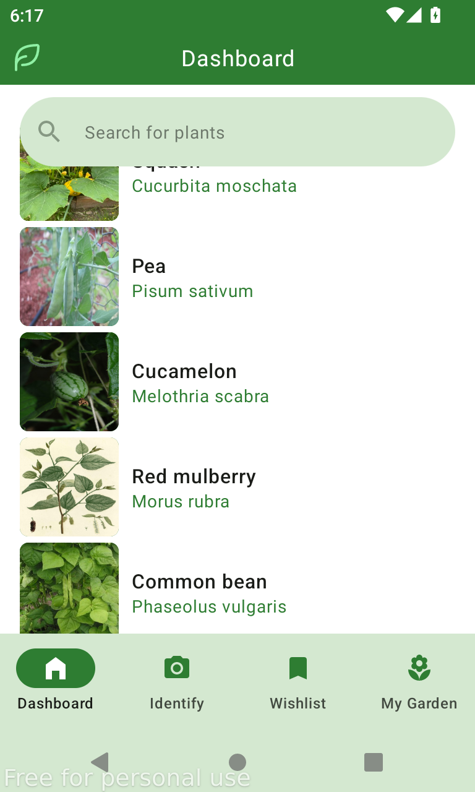
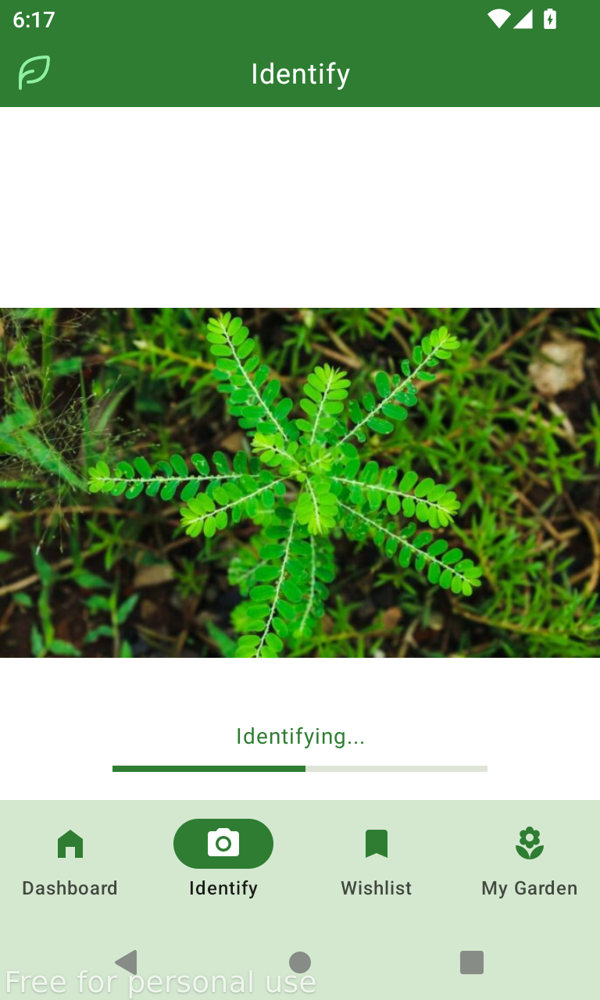
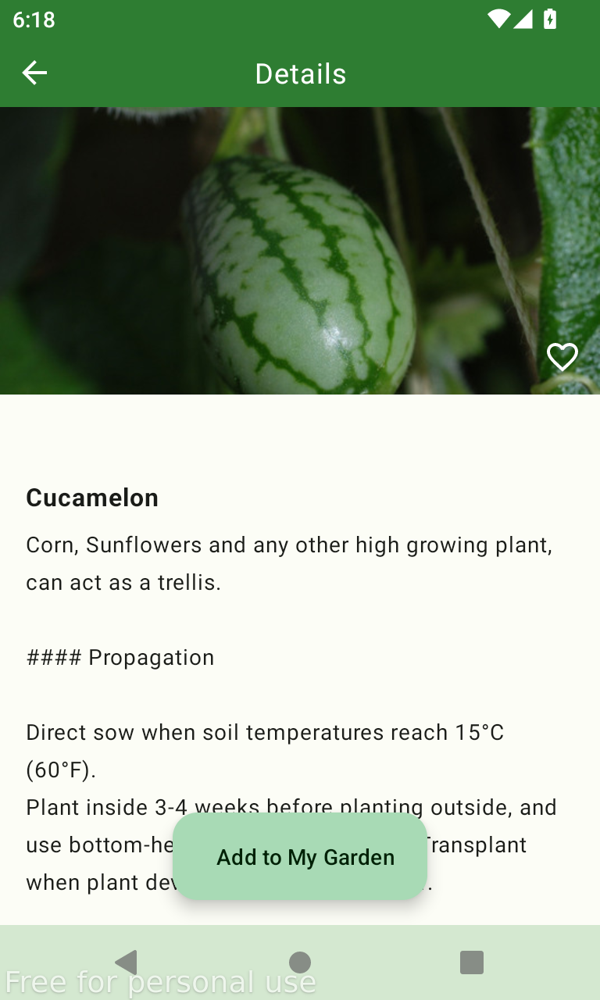
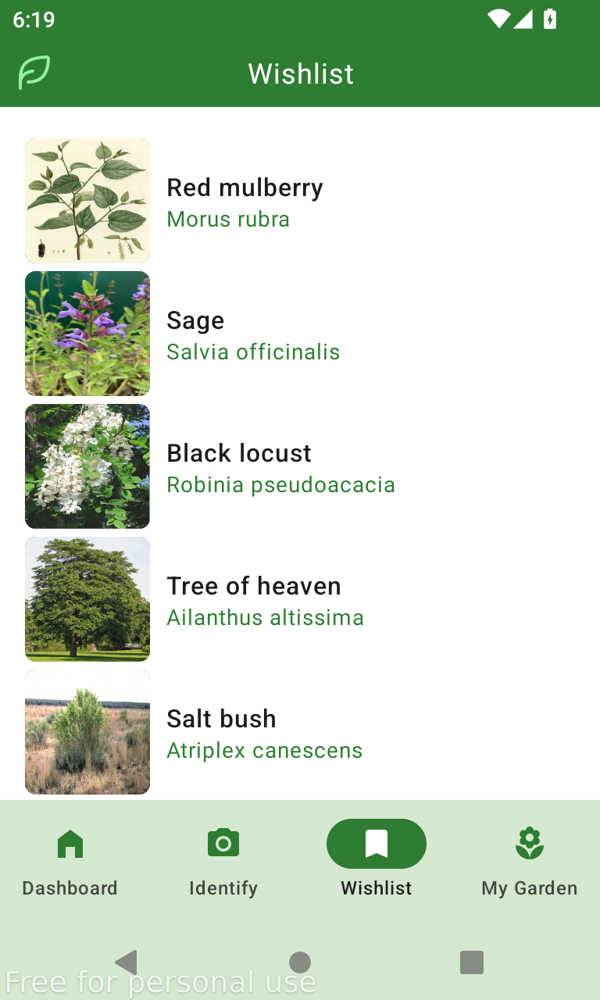

# Planture 🌱

A simple and intuitive Android application that helps users identify plants through camera capture or gallery selection, providing detailed information about each plant including care instructions.

## Features ✨

- **Plant Identification**: Capture photos using your camera or select from gallery to identify plants
- **Detailed Plant Information**: Get comprehensive details about identified plants including:
  - Plant description and characteristics
  - Care and nurturing instructions
  - Growing tips and requirements
- **Search Functionality**: Search for specific plants
- **Wishlist**: Save plants you're interested in for future reference
- **My Garden**: Keep track of your personal plants and their care schedules

## Screenshots 📱

  
| Home Screen | Plant Identification | Plant Details | Wishlist |
|-------------|---------------------|---------------|-----------|
|  |  |  |  |

## Demo Video 🎥

  

   
*Click the image above to watch the demo video*

## Tech Stack 🛠️

- **Language**: Kotlin
- **UI Framework**: Jetpack Compose
- **Dependency Injection**: Koin
- **Database**: Room
- **Image Loading**: Coil
- **Networking**: Retrofit
- **Architecture**: MVVM with Clean Architecture principles

## Usage 🚀

1. **Identify Plants**: 
   - Tap the camera button to capture a new photo
   - Or select an existing image from your gallery
   - Wait for the AI to process and identify the plant

2. **View Details**: 
   - Tap on any identified plant to see detailed information
   - Learn about care instructions and growing tips

3. **Search Plants**: 
   - Use the search bar to find specific plants
   - Browse through the plant database

4. **Manage Collections**:
   - Add interesting plants to your wishlist
   - Track your own plants in "My Garden"

## Contributing 🤝

Contributions are welcome! Please feel free to submit a Pull Request. For major changes, please open an issue first to discuss what you would like to change.

### Development Guidelines
- Follow Kotlin coding conventions
- Use Jetpack Compose best practices
- Write unit tests for new features
- Update documentation as needed

## Support 💬

If you encounter any issues or have questions:
- Open an issue on GitHub

## Acknowledgments 🙏

- Thanks to the plant identification API providers
- Special thanks to the open-source community

---

**Happy Plant Identifying! 🌿**
